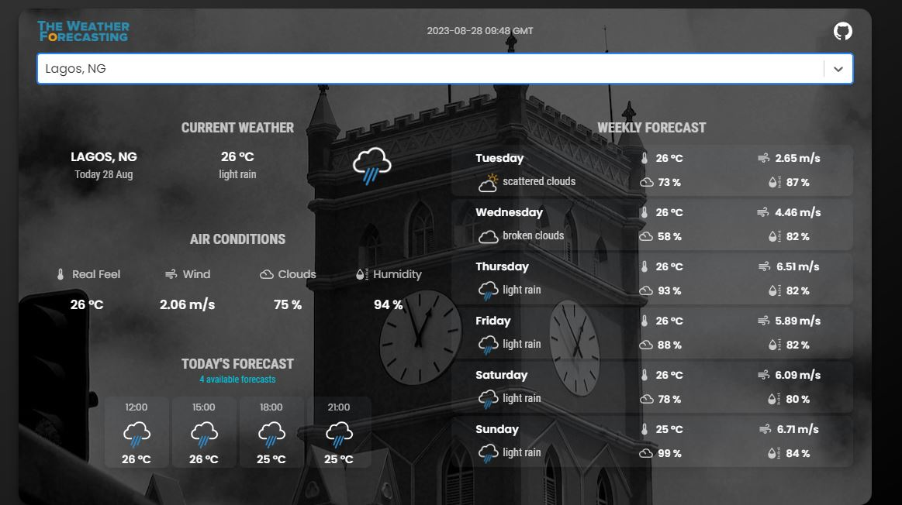

<br/>
<br/>

With [The Weather Forecasting](https://the-weather-forecasting.netlify.app) user can search locations by city name and observe the weather for the next 5-6 days and 3 hour interval.
<br />
The app is developed using React.js and material-UI.

<br/>

## 💻 Live Demo:

https://the-weather-forecasting.netlify.app

<br/>

## ✨ Getting Started

- Make sure you already have `Node.js` and `npm` installed in your system.
- You need an API key from [OpenWeatherMap](https://openweathermap.org/). After creating an account, [grab your key](https://home.openweathermap.org/api_keys).
- Then, under the `src` directory, go to `api/OpenWeatherService`.
- To protect your api key, install dotenv 
``` 
npm install dotenv
```
- create a .env file in your root directory, and add 
```
REACT_APP_API_KEY = replace-this-with-your-api-key
```
replace `WEATHER_API_KEY` with your OpenWeatherMap API Key.
  - **`api/OpenWeatherService.js`**: It contains the code related to the back-end of the application.

<br/>

## ⚡ Install

- Clone the repository:

```bash
git clone https://github.com/awssecwestafrica/React-Weather-Forecast-App.git

```

- Install the packages using the command `npm install`

<br/>

## Using Docker
- build image
```
docker build -t weather-forecast-app:v1 .
```
- or pull already built image from dockehub
```
docker pull ukemzyskywalker/weather-forecast:nginx-latest
```
- run image in detach mode and open port
```
docker run -itd -p 8080:3000 weather-forcast-app:v1
```

## 📙 Used libraries

- `react-js`
- `material-ui`

Check `packages.json` for details

<!-- <br/>

## 📄 Todos

- [ ] Styled-components
- [ ] Convert the entire project to TypeScript
- [ ] Unit Testing
- [ ] On launch, find user location weather by utilizing GeolocationAPI/GEOCODING
- [ ] Celcius/Fahrenheit conversion
- [ ] Dark/Light Mode

<br/>
Thank You ☺ -->
